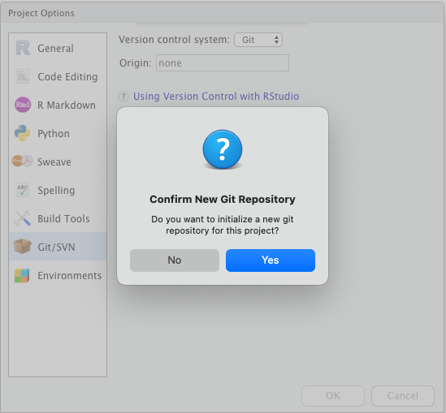
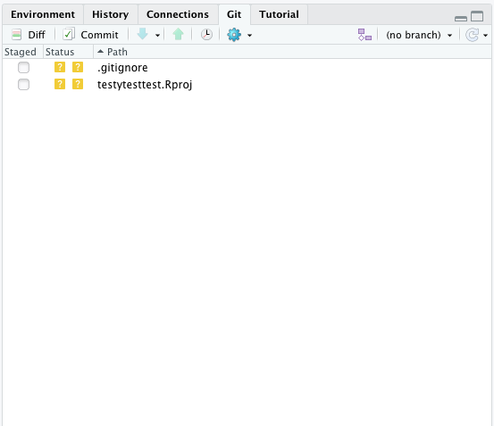

:::::::::::::::::::::::::::::::::::::: questions 

- How do you write a lesson using R Markdown and `{sandpaper}`?

::::::::::::::::::::::::::::::::::::::::::::::::

::::::::::::::::::::::::::::::::::::: objectives

- Explain how to use markdown with the new lesson template
- Demonstrate how to include pieces of code, figures, and nested challenge blocks

::::::::::::::::::::::::::::::::::::::::::::::::

## Version control with `git`

Have you ever needed to refer back to the edit history of a document to restore a change you'd made?  Or maybe you've sometimes worried about losing files that are only on your computer?  Do you waste lots of time deploying software manually?

OK, so maybe most of you probably haven't wasted time deploying software manually, but perhaps the other two are concerns you've had at some point.

All of these issues can be solved with the version control software `git`, when used together with a cloud-based repository such as github, bitbucket or gitlab.  

`git` keeps track of all the revisions to a repository that contains your code, allowing you to see when and where changes were made.  

](https://res.cloudinary.com/practicaldev/image/fetch/s--Dilp_rhi--/c_limit%2Cf_auto%2Cfl_progressive%2Cq_auto%2Cw_880/https://dev-to-uploads.s3.amazonaws.com/i/yi9n7h1klm5m6e3odcsa.png)

It also allows you to collaborate easily with other people with branches and methods for merging changes.

](https://res.cloudinary.com/practicaldev/image/fetch/s--pfmhZlvH--/c_limit%2Cf_auto%2Cfl_progressive%2Cq_auto%2Cw_880/https://dev-to-uploads.s3.amazonaws.com/i/8ito8dl7a62luwhp18xv.png)

In my opinion, it's an essential part of any project that involves code.  So how does it work?

## Creating a repository

We'll be working with git through Rstudio (there is a command line interface that I usually use, but it's used differently for each OS and has a bit more of a learning curve).

After you've installed git, you'll need to let Rstudio know how to find it.  

1. Open *Tools > Global Options* and click on *Git/SVN*.
2. Check *Enable version control interface for Rstudio projects*.
3. Set the path for the git executable.  If you don't know where this is, click on the `Terminal` tab in the bottom left pane and type:
 - Windows: `where git` - it'll be something like `C:/Program Files (x86)/Git/bin/git.exe`
 - MacOSX: `which git` - it'll be something like `/usr/bin/git`
4. Restart Rstudio

To add version control to your project:

1. Open *Tools > Version Control*
2. Change the version control system to *Git*
3. Click 'Yes' when it asks if you want to set up a new repository
4. You'll have to restart Rstudio again

You should notice a new tab available in the top right pane:

## Git gotchas

Don't use it for large files.

Keep other backups.

## Resources

 - [Git basics](https://dev.to/milu_franz/git-explained-the-basics-igc)
 - [Posit/Rstudio support article on git](https://support.posit.co/hc/en-us/articles/200532077)
 

::::::::::::::::::::::::::::::::::::: keypoints 

- Use `.md` files for episodes when you want static content
- Use `.Rmd` files for episodes when you need to generate output
- Run `sandpaper::check_lesson()` to identify any issues with your lesson
- Run `sandpaper::build_lesson()` to preview your lesson locally

::::::::::::::::::::::::::::::::::::::::::::::::

