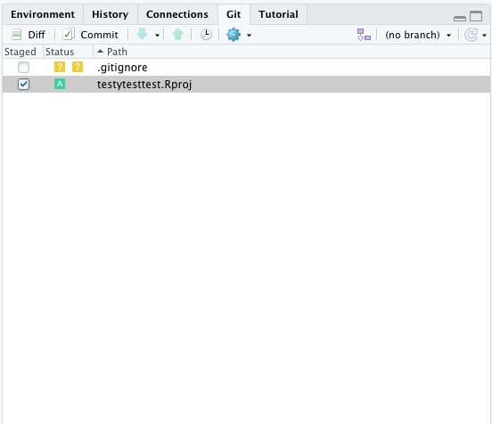
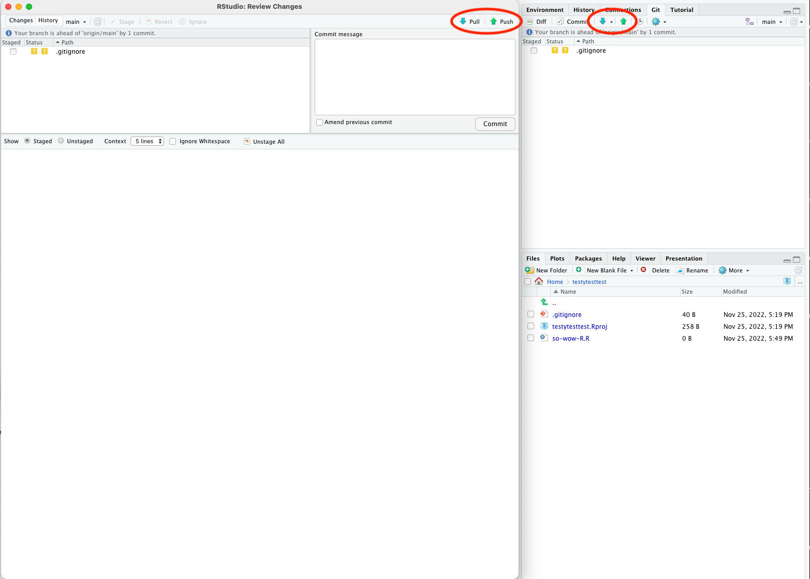

:::::::::::::::::::::::::::::::::::::: questions 

- What is version control?
- How to use git in Rstudio?

::::::::::::::::::::::::::::::::::::::::::::::::

::::::::::::::::::::::::::::::::::::: objectives

- Explain the basics of git
- Demonstrate how stage and commit files
- Demonstrate pulls and pushes from a remote repository

::::::::::::::::::::::::::::::::::::::::::::::::


## Version control with `git`

Have you ever needed to refer back to the edit history of a document to restore a change you'd made?  Or maybe you've sometimes worried about losing files that are only on your computer?  Do you waste lots of time deploying software manually?

OK, so maybe most of you probably haven't wasted time deploying software manually, but perhaps the other two are concerns you've had at some point.

All of these issues can be solved with the version control software `git`, when used together with a cloud-based repository such as github, bitbucket or gitlab.  

`git` keeps track of all the revisions to a repository that contains your code, allowing you to see when and where changes were made.  


](https://res.cloudinary.com/practicaldev/image/fetch/s--Dilp_rhi--/c_limit%2Cf_auto%2Cfl_progressive%2Cq_auto%2Cw_880/https://dev-to-uploads.s3.amazonaws.com/i/yi9n7h1klm5m6e3odcsa.png)

It also allows you to collaborate easily with other people with branches and methods for merging changes.

](https://res.cloudinary.com/practicaldev/image/fetch/s--pfmhZlvH--/c_limit%2Cf_auto%2Cfl_progressive%2Cq_auto%2Cw_880/https://dev-to-uploads.s3.amazonaws.com/i/8ito8dl7a62luwhp18xv.png)


In my opinion, it's an essential part of any project that involves code.  So how does it work?


## Creating a repository

We'll be working with git through Rstudio (there is a command line interface that I usually use, but it's used differently for each OS and has a bit more of a learning curve).

After you've installed git, you'll need to let Rstudio know how to find it.  


1. Open *Tools > Global Options* and click on *Git/SVN*.
2. Check *Enable version control interface for Rstudio projects*.
3. Set the path for the git executable.  If you don't know where this is, click on the `Terminal` tab in the bottom left pane and type:
 - Windows: `where git` - it'll be something like `C:/Program Files (x86)/Git/bin/git.exe`
 - MacOSX: `which git` - it'll be something like `/usr/bin/git`
4. Restart Rstudio

The easiest way to start working with a project is to initialize an empty repository.  I'll walk you though the process with github, but you can also use bitbucket or gitlab if you prefer (although I'm not as familiar with these).

Head to [github](https://github.com/) and if you aren't already logged in, look for the *Sign in* and *Sign up* buttons in the top right corner.  Make an account if necessary, and then sign in.  On the left hand side next to *Top Repositories*, click *New*.  Give your new repository a name and a description, and decide if you want it to be public or private.  Check the *Add a README file* box, then create the repository.

Back in Rstudio, 

 1. Open *File > New Project*
 2. Select *Version Control > Git*
 3. Grab the HTTPS URL from github (see picture below) and fill in the *Repository URL* box
 4. Set a name for your project directory - I usually make it the same as the name of the repository on github
 5. Choose where you want the project directory to be located
 


## Making changes

After you've set up your project, you'll probably want to add the `.Rproj` file to version control.  A new *Git* tab is available in the top right pane where you can do this.  You'll see in this panel that RStudio has created an `.Rproj` file for you when it created the project directory, and there'll be some **?** next to the file name.


At this point, you need to know how Git thinks about your files.  There are three statuses that your files can have:

 - Before you have told git about any of your changes, they only exist in your working directory.
 - To tell get that you've made some changes to your file, you need to **stage** it (`git add`).
 - Tell git that you're happy with the changed files by **committing** them.
 
You can reset the files in your repository to an earlier version using the **checkout** process.  


 
### Staging
 
So how do we **stage** a file? Just check the box next to the file name in the *Git* panel.
 

### Diff

At any time, you can check what you changed relative to the latest commit by clicking on *Diff*.


In this case, all the lines are green because we're adding a new file.  

### Commit

If you're happy with the changes you've made, you can **commit** them using the *Commit* button (next to *Diff*).  You will see the same view with your changes as you did with *Diff*, and an additional box to add a commit message - this is required for all commits.  Try to make it as informative as possible!


You should get a pop-up telling you the commit was successful.


 
### Push/pull
 
So far all the changes we've made have been to the *local* repository (that exists only on your computer).  After you've made some commits, you should **push** the changes to your remote repository so that your collaborators can see them, and they're backed up in the cloud.  If someone else has made changes to the same branch, you might need to **pull** and **merge** any changes that are in the repository but not on your local computer first.


You can push and pull from the same pop-up panel you get when you click *Commit*, or int the *Git* tab in the top-right pane.



Your first push should be pretty straightforward.

If there are changes in the remote repository that you don't have in your local repository, you'll need to pull them before you can push any changes.


The first time you try a pull like this, you might get this message:


This just means that you have to open a terminal and type in one of those options.  I won't go into details about what they all mean, but I usually use `git config pull.rebase false`.  You'll have to open a shell from the menu with *Tools > Shell* (on Mac you can just use the terminal pane at the bottom left), type this command and press enter.

Try your pull again and it should then work.  Your files should be updated!


## Branches

I mentioned earlier that you can create **branches**.  Their purpose is to facilitate work on the same files as your collaborators without immediate conflicts.  When you are ready to integrate your changes, you can open a **pull request** and **merge** the changes.

While using branches is a fundamental part of git, I won't go into any more detail than that now.  You can read more about how branches work in the [git documentation](https://git-scm.com/book/en/v2/Git-Branching-Branches-in-a-Nutshell).

## Command line git

So far, we've used git through the Rstudio terminal.  However, this will only get you so far, and eventually you'll want to do something more complicated you'll probably need to use a shell.  You can open one from the menu with *Tools > Shell*.

The [git documentation](https://git-scm.com/book/en/v2/Git-Branching-Branches-in-a-Nutshell) has all the information you'll need for using the command line, but just to get you started, you can try:

```bash
# print summary of changed, staged files
git status

# stage file
git add <file1> <file2>

# commit changes
git commit -m "My informative commit message"

# push to remote
git push

# pull changes from remote
git pull
```

## Git gotchas

There are a few things you should be aware of when working with git.

### Don't add large files

Git was designed for working with source code (text files), not binaries or large datasets.  Every time you check the status of your repository with `git status`, it looks at all the files that you've committed.  If you have added large files, like NGS data, large images, or compiled binaries, git has to look through those files for changes, which can really slow things down.

I tend to avoid adding any of the data that I'm working with to version control, unless it's a very small text file or image.  Github also limits the size of individual files, and the total size of each repository, so avoid hitting those limits by keeping large files separate.  You can still keep them in the same directory as your code, but avoid doing `git add` on them.

## Keep other backups

Although your code is pretty safe in the cloud, it's good practice to keep other backups of your code elsewhere.  Since your data shouldn't be in your repository, you'll need to think about other backups anyway. So keep your code and data backed up somewhere else, like other clouds (e.g. One Drive), CMRI shared folders and portable hard drives (but never *only* on a portable hard drive).

## Resources

 - [Git documentation](https://git-scm.com/book/en/v2)
 - [Git basics](https://dev.to/milu_franz/git-explained-the-basics-igc)
 - [Posit/Rstudio support article on git](https://support.posit.co/hc/en-us/articles/200532077)
 

::::::::::::::::::::::::::::::::::::: keypoints 

- Keep your files safe and keep track of changes with version control
- Use github as a remote repository for your code
- Stage and commit changes to your files so that git keeps track of them
- Push your changes to your remote repository, and pull changes made by others

::::::::::::::::::::::::::::::::::::::::::::::::

