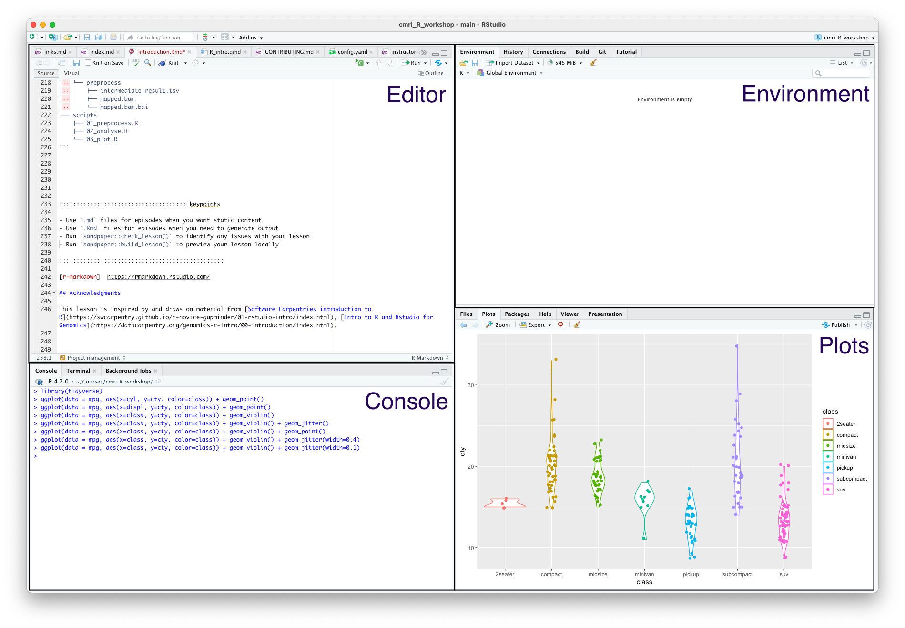
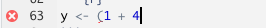
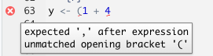
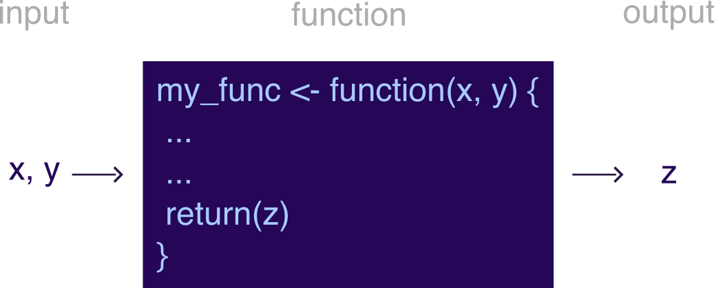

:::::::::::::::::::::::::::::::::::::: questions 

- How do I use the RStudio IDE?
- What are the basics of R?
- What are the best practices for writing R code?

::::::::::::::::::::::::::::::::::::::::::::::::

::::::::::::::::::::::::::::::::::::: objectives


- Understand how to interact with the RStudio IDE
- Demonstrate some R basics: operators, comments, functions, assignment, vectors and types
- Be aware of some good habits for writing R code

::::::::::::::::::::::::::::::::::::::::::::::::


## Why R?

The `R` language is one of the most commonly used languages in bioinformatics, and data science more generally.  It's a great choice for you because:

 - Reproducibility: Scripting your analysis makes it easier for someone else to repeat and for you to re-use and extend
 - Power: `R` can be used to work with datasets larger than you can in Prism or Excel
 - [Open source](https://en.wikipedia.org/wiki/Open_source): So it's free!
 - Community:  `R` is a popular choice for data science, so there are many resources available for [learning](https://swcarpentry.github.io/r-novice-gapminder/) and [debugging](https://stackoverflow.com/questions/tagged/r)
 - Packages:  Since the community is large, many people have written helpful packages that can help you do tasks more easily than if you'd had to start from scratch
 
The other language most commonly used  for data science is `python`.  Some people might even consider it a better choice than `R`, because it doesn't have some of the strange quirks that `R` does, and also has a large community of users (and all of the benefits that come with it).  

I use both `R` and `python`, and most (but not all) people who do a lot of data science know how to use both. But today we're learning `R` because I think it usually what I turn to when someone in the lab asks me for help analysing their data, and I think everyone can learn to use it for those same tasks too.

I made all of the material for this course (including the website and slides) in `Rstudio` using `R`.  A little bit can take you a long way!

### There's more than one way to skin a cat

This course will teach a particular 'dialect' of `R` called the tidyverse.  This is a collection of packages mostly written by Hadley Wickham, that focus on the concept of 'tidy' data.

You'll soon discover that when coding, there are many ways of getting to the same output.  Some of them are more efficient than others, and some of them are just easier to code than others.  The tidyverse packages are hugely popular in the R community, and when I started I found them easy to work with. 

However, if you stick with `R` long enough, you'll probably end up needing to learn some additional base R (particularly if you use packages from outside the tidyverse).  If you want to get a head start, I'll include some links to resources at the end of this lesson.

:::::::::::: challenge

## Do I need to do this lesson?

This lesson teaches the very basics.  If you can predict what will happen after every section of the following script (and you known what a comment is), you can skip this lesson.


```r
# section 1
100 ** 1

# section 2
a <- 4
b <- 3
a + b

# section 3
round(3.1415, digits=2)

# section 4
library(stats)

# section 5
stringr::str_length("what is the output?")

# section 6
as.integer(c(1.96,2.09,3.12))

# section 7
as.numeric(c("one", "two", "three"))

```


::::::::::: solution


```r
# section 1
100 ** 1
```

```{.output}
[1] 100
```

100 to the power of 1 is 100


```r
# section 2

# assign the value 4 to variable a
a <- 4
# assign the value 3 to variable b
b <- 3
# add the values of a and b
a + b
```

```{.output}
[1] 7
```

4 + 3 is 7


```r
# section 3
round(pi, digits=2)
```

```{.output}
[1] 3.14
```

Using the `round()` function to round  $\pi$ to two decimal places gives the result 3.14


```r
# section 4
library(stats)
```

No output, just loading the `stats` library.


```r
# section 5
stringr::str_length("what is the output?")
```

```{.output}
[1] 19
```

You might need the help function for this one - there are 19 characters in the string.


```r
# section 6
as.integer(c(1.96,2.09,3.12))
```

```{.output}
[1] 1 2 3
```

Coercing a vector of type double to integers truncates numbers to give integers.


```r
# section 7
as.numeric(c("one", "two", "three"))
```

```{.warning}
Warning: NAs introduced by coercion
```

```{.output}
[1] NA NA NA
```

This one is tricky!  Trying to coerce a string that isn't only digits just results in NA values.

::::::::::::::::::

:::::::::::::::::::::::

## Introduction to RStudio

`RStudio` is an [integrated development environment](https://en.wikipedia.org/wiki/Integrated_development_environment) that makes it much easier to work with the `R` language.  It's free, cross-platform and provides many benefits such as project management and version control integration.

When you open it, you'll see something like this:


{alt='Four panes of RStudio, showing the editor, console, environment and plots panel'}

The four main panes are:

 - Top left: editor. For editing scripts and other source code
 - Bottom left: console.  For running code
 - Top right: environment. Information about objects you create will appear here
 - Bottom right: plots (amongst other things). Some output (like plots) from the console appears here.  Also helpful for browsing files and getting help


 
### Using the editor

Use the editor to write scripts and `Rmarkdown` documents.  Although you can also type commands directly into the console, keeping your commands together in a script helps organise your analysis.


The editor also helps you identify issues with your code by placing a cross where it doesn't understand something.

{alt='A cross in the margins where a line of code is syntatically incorrect'}

Hover over the cross to get more information

{alt='Mousing over the cross reveals the message "expected , after expression" and "unmatched opening bracket ('}


 
### Using the console

The console is where you can type in `R` commands and see their output. You can type R commands directly in here, or press <kbd>Ctrl</kbd>/<kbd>Cmd</kbd> + <kbd>Shift</kbd> + <kbd>Enter</kbd> to 'send' them from the editor to the console.


#### As a calculator

The most basic way we can use R is as a calculator:


```r
1 + 1
```

```{.output}
[1] 2
```


If you type an incomplete command, you'll see a `+`:

```r
1 +
```
```output
+
```

Finish typing the command to get back to the prompt (`>`).


The order of operations is as you would expect:

 - Parentheses `(`, `)`
 - Exponents `^` or `**`
 - Multiply `*`
 - Divide `/`
 - Add `+`
 - Subtract `-`
 

::::::::::::::::::::::::::::::::::::: challenge 

#### Challenge 1: Operators


How would you use R to compute $\frac{9}{3 + 6}$?

:::::::::::::::::::::::: solution 

#### Show me the solution
 

```r
3 / (3 + 6)
```

```{.output}
[1] 0.3333333
```

:::::::::::::::::::::::::::::::::

::::::::::::::::::::::::::::::::::::::::::::::::


## Writing R code

Next, we'll look at some of the building blocks of `R` code.  You can use these to write scripts, or type them directly into the console.  

When performing data analysis, it's best to record the steps you took by writing a script, which can be re-run if you need to reproduce or update your work.

### Comments

The first building block is actually lines that are ignored by `R`: comments.
Anything that comes after a `#` character won't be executed. Use this to annotate your code.  


```r
# this is a comment
1 + 2 # this is also a comment
```

```{.output}
[1] 3
```

```r
# the line below won't be executed
# 1 + 1
```


Comments is very important!!!  A key part of reproducibility is knowing what code does.  Make it easier for others and your future self by adding lots of comments to your code.

:::::::::::::::::::::::::::::::::::::::: callout

#### Debugging by comment

You can also use comments when testing and debugging your code, by preventing `R` from running particular lines of your script.  RStudio provides a shortcut for commenting/uncommenting lines: <kbd>Ctrl</kbd>/<kbd>Cmd</kbd> + <kbd>Shift</kbd> + <kbd>c</kbd>.


::::::::::::::::::::::::::::::::::::::::::::::::

### Assignment

If you want `R` to remember something, you can assign it to a variable:


```r
my_var <- 1+1
print(my_var)
```

```{.output}
[1] 2
```


:::::::::::::::::::::::::::::::::::::::: callout

#### Hello, operator?

There are actually two assignment operators in `R`: `<-` and `=`.  They differ a little in their behaviour (you don't need to know all of the details of how they differ); in general you should use `<-` for assignment.
::::::::::::::::::::::::::::::::::::::::::::::::


::::::::::::::::::::::::::::::::::::: challenge 

#### Challenge 2: Assignment


What would be the output of the following code?  Try to think about what the answer would be without using `R`.

```r
a <- 3
b <- 2
c <- (a * b) / b + 1
print(c)
```

:::::::::::::::::::::::: solution 

#### Show me the solution
 

```r
a <- 3
b <- 2
c <- (a * b) / b + 1
print(c)
```

```{.output}
[1] 4
```

:::::::::::::::::::::::::::::::::

::::::::::::::::::::::::::::::::::::::::::::::::


### Functions

A function is just something that takes zero or more inputs, does something with it, and gives you back zero or more outputs.  


{alt='A function takes as input (x,y), does some stuff, and outputs z' width='50%'}


`R` comes with many useful functions that you can use in your code.  A function is always called with parentheses `()`.

For example, the `getwd()` function takes no inputs, and returns the current working directory.

```r
# a function that takes no inputs
getwd()
```

Base `R` also has many mathematical and statistical functions:


```r
# natural logarithm
log(1)
```

```{.output}
[1] 0
```

```r
# rounding
round(0.555555, digits=3)
```

```{.output}
[1] 0.556
```

```r
# statistical analysis
t.test(c(1, 2.5, 8, 1), c(1000, 1001, 3000, 5000))
```

```{.output}

	Welch Two Sample t-test

data:  c(1, 2.5, 8, 1) and c(1000, 1001, 3000, 5000)
t = -2.6085, df = 3, p-value = 0.07979
alternative hypothesis: true difference in means is not equal to 0
95 percent confidence interval:
 -5543.6641   549.4141
sample estimates:
mean of x mean of y 
    3.125  2500.250 
```

You don't need to memorize all these functions: Google is your friend.

RStudio can also help you with function usage. If you know what the name of a function is but can't remember how to use it, you can type `?` before the function name in the console to get help on that function.

```r
?sin
```

If you don't know what the name of a function is, you can type `??` before a key word to search the documentation for that key word.

```r
??trig
```

:::::::::::::::::::::::::::::::::::::::: callout

#### Named arguments

Function arguments can be named *implicitly* or *explicitly*.  When calling a function, explicitly named arguments are matched first, then any other arguments are matched in order.

For example, the documentation for the `round` function gives its signature: `round(x, digits = 0)`.

The following function calls are all equivalent:

```r
round(1/3, 3)
round(1/3, digits=3)
round(x=1/3, digits=3)
round(digits=3, x=1/3)
```

However, the last is not best practice: reversing the order of the arguments will likely be confusing for someone else reading your code.

In general, try to match the documentation when you call a function.

Which of the calls above matches the documentation for `round()`?

:::::::::::::::::::::::: instructor

The second one

:::::::::::::::::::::::::::::::::::


::::::::::::::::::::::::::::::::::::::::::::::::


You can also write your own functions:


```r
# function to add two numbers
my_add <- function(num1, num2) {
  return(num1 + num2)
}
my_add(1,1)
```

```{.output}
[1] 2
```

::::::::::::::::::::::::::::::::::::: challenge 

#### Challenge 3: Functions


Use the R console to get help on the `rnorm()` function

:::::::::::::::::::::::: solution 

#### Show me the solution
 
```r
?rnorm
```

:::::::::::::::::::::::::::::::::

Use the `rnorm` function to generate 5 numbers from a normal distribution with a mean of 1 and a standard deviation of 2.

:::::::::::::::::::::::: solution 

#### Show me the solution
 

```r
rnorm(5, mean=1, sd=2)
```

```{.output}
[1] -3.0220752 -0.7154340  3.2381934 -1.0907571 -0.6847144
```

:::::::::::::::::::::::::::::::::


::::::::::::::::::::::::::::::::::::::::::::::::


### Using libraries

One of the great things about `R` is that a lot of other people use it, so often somebody has worked out an efficient way of doing things that you can use.  This way, you don't have to build your code from the ground up; instead you can use functions that other people have written.

When you use other peoples' functions, they will be packaged in to *libraries* (also called *packages*) that you can import.  In order to use library, it first must be installed.  R provides the function `install.packages()` which you can use to install libraries from `CRAN` (an online repository of libraries).

```r
install.packages("library_name")
```

Note the use of quotation marks around the library name - this tells `R` that this is a string, rather than a variable (more on strings in the next section).

::::::::::::::::::::: challenge

#### Challenge 4: Installing a library

What code would you use to install the `tidyverse` library?  Try it out!

::::::::::::: solution 

#### Show me the solution

```r
install.packages("tidyverse")
```
::::::::::::::::::::::

:::::::::::::::::::::::::::::::


::::::::::::::::::::: callout

#### Package-ception

Most of the packages that you'll use will come from `CRAN`, but you might come across other sources of packages that are also useful.  These are usually installed by packages that you can get from `CRAN`.  

For example, the [`Bioconductor`](https://www.bioconductor.org/) suite consists of packages that are useful for bioinformatics. To install any `Bioconductor` libraries, you'll first need to install the `BiocManager` package from `CRAN`, and then use functions from this library to install `Bioconductor` packages.

```r
# install BiocManager package
install.packages("BiocManager")

# use the install function from BiocManager to install the GenomicFeatures and karyoploteR libraries
BiocManager::install(c("GenomicFeatures", "karyoploteR"))
```

Another place you might install packages from is [`github`](https://github.com/). Many developers host their code for their package on `github`, and then release it to `CRAN` when they think it's ready.  

If you want to use the development version of a package (for example if you want to use a feature that hasn't been released yet), you can get it directly from `github` using the `devtools` package. Be careful when you do this - you'll get all the shiny newest features, but you might also run into new bugs that haven't been fixed yet!

For example, if you want to install the [development version of `readr` from `github`](https://github.com/tidyverse/readr):

```r
# install the devtools package
install.packages("devtools")

# use the install function from devtools to install readr
devtools::install_github("tidyverse/readr")
```

:::::::::::::::::::::::::::::


By default, the only functions that when you start up `R` are the _base R_ functions.  If you want to use any functions from libraries that you've installed, you'll need to tell `R` which library they come from.

One way to do this is is to use the `::` syntax: `packagename::functionname()`.  For example, we can use the `str_length()` function from the `stringr` package as follows


```r
stringr::str_length("testing")
```

```{.output}
[1] 7
```


::::::::::::::::::::: challenge

#### Challenge 5: Using a library

What do you think will happen if we omit the `packagename::` part?

::::::::::::: solution 

#### Show me the solution


```r
str_length("testing")
```

```{.error}
Error in str_length("testing"): could not find function "str_length"
```

We get an error because `R` doesn't know what the `str_length()` function is by default.

::::::::::::::::::::::

::::::::::::::::::::::::::::::


The other way to use functions from a library is to import all the functions in the library using the `library()` function.  It's best practice to put all the `library()` calls together at the top of your code, rather than sprinking them throughout.


```r
# import whole library
library(stringr)

# use the str_length function without ::
str_length("testing")
```

```{.output}
[1] 7
```

You can still use the `packagename::functionname()` syntax even if you've loaded the library. This makes it clear which library the function comes from, and some style guides recommend that you do this for every function you use.

::::::::::::::::::::::::: callout

#### Function conflicts

The order you load your packages is important. If two functions from two different packages you've loaded have the same name, the one you loaded last will be used.  Sometimes packages will warn you about this - for example, when you load the `tidyverse` package (which is actually a collection of packages), you'll see something like this.


```r
library(tidyverse)
```

```{.output}
── Attaching packages ─────────────────────────────────────── tidyverse 1.3.2 ──
✔ ggplot2 3.4.0      ✔ purrr   0.3.5 
✔ tibble  3.1.8      ✔ dplyr   1.0.10
✔ tidyr   1.2.1      ✔ forcats 0.5.2 
✔ readr   2.1.3      
── Conflicts ────────────────────────────────────────── tidyverse_conflicts() ──
✖ dplyr::filter() masks stats::filter()
✖ dplyr::lag()    masks stats::lag()
```

This tells us that the `filter()` function from `dplyr` has overwritten (or 'masked') the `filter()` function from the `stats` package, and there is a similar conflict for `lag()`.  

You can still use `stats::filter()` in your code, but you must explicitly specify that you want to use the`stats` package by prefixing it with `stats::`.  If you just use `filter()`, you'll get the version from `dplyr`.  

Not all packages warn you about conflicts, so be careful you're using the function that you think you're using!  This can be a source of strange errors, so try adding `packagename::` in front of your function calls if you this this might be happening.

:::::::::::::::::::::::::::::::::


::::::::::::::::::::::: challenge

#### Challenge 6: Best practices


In which situations do you think it's best to use the `packagename::functionname()` syntax, and when should you use `library()`?


:::::::::: solution 

There's no wrong or right answers here, but you might come across people that have (strong) opinions in this area.

Usually, if I'm only using one or two functions from a library, I won't import the whole library, but just use the `packagename::functionname()` syntax.   If I'm going to be using a lot of functions from a library, I'll use `library()`.

Some people consider it best practice to always use `packagename::functionname()`, since then it's clear which packages are being used and where.  This also helps avoid conflicts between functions with the same name in different packages.  

However, this style is quite verbose (and a little distracting), and some people might say that this makes code written this way less readable.  In practice, I haven't come across much code that always uses explicit package names.

:::::::::::::::::::

:::::::::::::::::::::::::::::::::

### Vectors

One of the most common data structures `R` is the *vector*.  These are collections of elements (technically called 'atomic vectors') like numbers, which are arranged in a particular order.

Vectors are often created with the concatenation function `c()`:


```r
# create a vector of three numbers
a_vector <- c(1,2,3)

# order matters!
a_different_vector <- c(2,1,3)
```


You can get at the individual elements of a vector using brackets (`[`):

```r
# first element of double_vec
double_vec[1]

# third to fifth elements of integer_vec
integer_vec[3:5]

#first and fourth elements of character_vec
character_vec[c(1,4)]
```

In `R`, vectors contain data of only one type.  Some of the types you might see are:

 - Double: real numbers which can take on any value (like 1.13, 6, -1004.29)
 - Integer: whole real numbers (like 1, 2, -1)
 - Character: strings of characters, enclosed in either single or double quotes
 - Logical: booleans, either `TRUE` or `FALSE`
 

```r
# we can use the seq function to create vectors with numbers in them
double_vec <- seq(1, 10)

# add 'L' to the end of a number to tell R that it's an integer
integer_vec <- seq(1L, 10L)

# strings can be enclosed in single or double quotes
character_vec <- c("this", 'is', "a", 'vector')

# logicals are either TRUE or FALSE
logical_vec <- c(TRUE, FALSE)
```

:::::::::::::::::::::::: callout

#### Declaring types
 
In some programming languages, like `C` and `java`, the programmer must declare the type of a variable when it's created.  In these [statically typed](https://developer.mozilla.org/en-US/docs/Glossary/Static_typing#:~:text=A%20statically%2Dtyped%20language%20is,not%20indicate%20their%20variable%20types.) languages, a variable declared as an integer can't store any other types of data.  As a dynamically typed language, `R` takes a looser approach to variable types.

:::::::::::::::::::::::::::::::::

If you try to create a vector that contains more than one type of element, all the elements will be transformed into the 'lowest common denominator' type.  For example, concatenating an integer and double  will result in a double vector.


```r
# concatenting a double and an integer
numeric_vec <- c(5.8, 10L)

# the typeof function tells you the type of a variable
typeof(numeric_vec)
```

```{.output}
[1] "double"
```

One way to think about this is that elements are always coerced into the type that results in the least amount of information loss.  The integers are a subset of all real numbers, so we can easily represent an integer `10L` as the numeric `10`.  But if we tried to convert the real number `5.8` to an integer, how do we deal with the `.8` part?

::::::::::::::::::::::::::::::::::::: challenge 

#### Challenge 7: Types


What do you think will be the type of the following vector?

```r
unknown_type <- c(1L, 1, "one")
```


:::::::::::::::::::::::: solution 

#### Show me the solution
 


```r
unknown_type <- c(1L, 1, "one")
print(unknown_type)
```

```{.output}
[1] "1"   "1"   "one"
```

```r
print(typeof(unknown_type))
```

```{.output}
[1] "character"
```

It's  a character vector.  

Character vectors can be used to represent numbers, but numbers can't easily be used to represent characters.


:::::::::::::::::::::::::::::::::

::::::::::::::::::::::::::::::::::::::::::::::::


`R` also has a way of representing missing data: there's a special value in every type called `NA` (not available).


```r
vec <- c(1, 3, NA)
```

Having `NA` values can change the way that functions interact with your data.  For example, how would you take the mean of three values: 1, 2, and NA?


```r
mean(c(1, 2, NA))
```

```{.output}
[1] NA
```

`R` doesn't know how to do this, so it just returns `NA`.


::::::::::::::::::::::::::::::::::::: challenge 

#### Challenge 8: Removing NA


Check the documentation of the `mean` function to find out how to ignore `NA` values when computing the mean of a vector.


:::::::::::::::::::::::: solution 

#### Show me the solution
 


```r
mean(C(1,2, NA), na.rm=TRUE)
```

```{.error}
Error in C(1, 2, NA): object not interpretable as a factor
```

Use the additional named argument `na.rm=TRUE`

:::::::::::::::::::::::::::::::::

::::::::::::::::::::::::::::::::::::::::::::::::

## Best practices

Now you know the basics of `R`, there are a few best practices that you should follow on your journey.  These aren't hard and fast rules, but principles that you should aim to follow to make your code better and more reproducible.


### Formatting and readability matters

You should always be able to come back to your code after a long break (months, years) and easily understand what it does.

One thing that helps with this is to follow a style guide like [this one for the tidyverse](https://style.tidyverse.org/)

This covers things like:

 - Commenting:  do this a lot!  It's better to have more comments than fewer
 - Each script should start with a description of what it does or what it's for
 - When you have to name something, use a name that makes sense.  You're more likely to understand what is contained in variable `my_peptide` than you are if it was called `p` or `x` or `owobljldfibllkmb`
 - Syntax and spacing: use spaces and newlines to make your code more readable, not less
 - Line length: try to make horizontal scrolling unnecssary, which usually means lines are less than 80 characters

 

### Don't copy/paste code

Try to avoid copy-pasting blocks of code.  If you find you need to make a change to that code, you'll need to edit all the copies. If you do this, it's  easy to miss somewhere that you copied it, or make a mistake when you change it.  If you find yourself needing to do the same task many times, it's usually better to write a function instead.  


### Test your expectations

Try to frequently test your code to see that it does what you expect it to do.  Getting into this habbit helps guard against bugs.  

There are lots of different ways to do this, from just trying out the code with a few different inputs to automated [unit testing](https://en.wikipedia.org/wiki/Unit_testing)

Don't forget also to test that your code doesn't do things that you don't expect it to do as well!

```r
# define a function
plus_three <- function(num) {
  return( num + 3 )
}

# should return 11
plus_three(8)

# should return 2
plus_three(-1)

# should raise an error
plus_three("ten")

```

You can use the [function `stopifnot`](https://www.rdocumentation.org/packages/base/versions/3.6.2/topics/stopifnot) to help you check things automatically.

### Project management

Aim to keep your data, scripts and output organized.  `RStudio` helps you with this with Projects, which can be used to store all of the files related to a particular piece of analysis.  People write [whole papers](https://github.com/swcarpentry/good-enough-practices-in-scientific-computing/blob/gh-pages/good-enough-practices-for-scientific-computing.pdf) about this, but here are a few suggestions:

 - Treat raw data and metadata as read-only.  Put it in a folder called `data` and don't write anything to that folder except for more raw data
 - Put source code in a folder called `src`
 - Put files generated during analysis in a folder called `out` or `results`.  It shouldn't matter if this folder gets deleted, since you should be able to re-create its contents using your data and scripts
 - A `README` file can be useful for a broad overview of the project, and for explaning how to run the analysis
 - Keep track of the packages required for your analysis using [`renv`](https://rstudio.github.io/renv/articles/renv.html) (for `R` projects only), or `conda` (more general but has a few gotchas for `R` packages)
 
That is, an organized project might look something like this:

```
my_great_project
├── README.md
├── data
│   ├── dataset_1
│   │   ├── dataset_1.R1.fq.gz
│   │   └── dataset_1.R2.fq.gz
│   ├── dataset_2
│   │   ├── dataset_2_1.R1.fq.gz
│   │   ├── dataset_2_1.R2.fq.gz
│   │   ├── dataset_2_2.R1.fq.gz
│   │   └── dataset_2_2.R2.fq.gz
│   └── metadata
│       ├── metadata_1.tsv
│       └── metadata_2.tsv
├── renv
│   └── activate.R
├── results
│   ├── analyse
│   │   └── fold_change.tsv
│   ├── plot
│   │   ├── phylogeny.pdf
│   │   └── taxa.pdf
│   └── preprocess
│       ├── intermediate_result.tsv
│       ├── mapped.bam
│       └── mapped.bam.bai
└── scripts
    ├── 01_preprocess.R
    ├── 02_analyse.R
    └── 03_plot.R
```
 


::::::::::::::::::::::::::::::::::::: keypoints 

- Use RStudio for writing and executing `R` code
- Add comments to your code by starting a line wtih `#`
- Assign values to variables using the assignment operator `<-`
- Functions covert inputs to outputs
- Vectors are a collection of values of the same type
- Following best practices will help the with the correctness and readabilty of your `R` code

::::::::::::::::::::::::::::::::::::::::::::::::

[r-markdown]: https://rmarkdown.rstudio.com/

## Resources

### Cheat sheets

As you begin your journey with `R`, you might find it helpful to refer to one-page summaries (or 'cheat sheets') that other people have compiled.  For example, there are cheat sheets for :


- [Commonly used functions](https://drive.google.com/file/d/1bo8vMXeeiRy8l89eIjOALezO3V5oaewY/view)
- [RStudio IDE](https://raw.githubusercontent.com/rstudio/cheatsheets/main/rstudio-ide.pdf)

### Links

 - [R for data science](https://r4ds.had.co.nz/index.html)
 - [fasteR, a course teaching (mainly) base R](https://github.com/matloff/fasteR)
 - [Ten Simple Rules for Reproducible Computational Research](https://journals.plos.org/ploscompbiol/article?id=10.1371/journal.pcbi.1003285)
 - [More information about installing R packages](https://www.datacamp.com/tutorial/r-packages-guide)

## Acknowledgments

This lesson is inspired by and draws on some material from [Software Carpentries introduction to R](https://swcarpentry.github.io/r-novice-gapminder/01-rstudio-intro/index.html), [Intro to R and Rstudio for Genomics](https://datacarpentry.org/genomics-r-intro/00-introduction/index.html).

