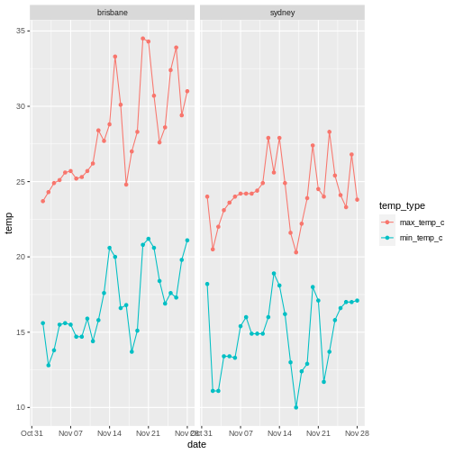

:::::::::::::::::::::::::::::::::::::: questions 

- How do you visualize data using `ggplot2`?
- How can you combine individual plots?

::::::::::::::::::::::::::::::::::::::::::::::::

::::::::::::::::::::::::::::::::::::: objectives

- Understand how to use aesthetics to create plots
- Use geoms to create visualizations
- Know how to facet to split by grouping variables
- Modify visual elements using themes
- Combine plots using `patchwork`


::::::::::::::::::::::::::::::::::::::::::::::::


After all of that data manipulation perhaps you, like me, are a bit sick of looking at tables.  Using visualizations is essential for communicating your results, because [summary statistics can be misleading](https://ab604.github.io/docs/coding-together-2019/viz.html), and because large datasets don't display well in tables.

I won't go into too much theory here about the best way of visually representing different kinds of datasets, but I'd recommend everyone take a look at [Claus Wilke's excellent book 'Fundamentals of data visualization'](https://clauswilke.com/dataviz/).

One popular framework for greating plots is the ['grammar of graphics' approach](http://vita.had.co.nz/papers/layered-grammar.pdf).  The idea here is to build up a graphic from multiple layers of components, including:

 - data and aesthetic mappings
 - geometric objects
 - scales
 - facets
 
In this lesson we explore how to use these elements to make informative and visually appealing graphs.

We'll again use the weather data for Brisbane and Sydney, so let's load this dataset.


```r
# load tidyverse
library(tidyverse)
```

```{.output}
── Attaching packages ─────────────────────────────────────── tidyverse 1.3.2 ──
✔ ggplot2 3.4.0      ✔ purrr   0.3.5 
✔ tibble  3.1.8      ✔ dplyr   1.0.10
✔ tidyr   1.2.1      ✔ stringr 1.4.1 
✔ readr   2.1.3      ✔ forcats 0.5.2 
── Conflicts ────────────────────────────────────────── tidyverse_conflicts() ──
✖ dplyr::filter() masks stats::filter()
✖ dplyr::lag()    masks stats::lag()
```

```r
# data files
data_dir <- here::here("..", "episodes", "data") # change this for your computer
data_files <- file.path(data_dir, c("weather_sydney.csv", "weather_brisbane.csv"))

# column types
col_types <- list(
  date = col_date(format="%Y-%m-%d"),
  min_temp_c = col_double(),
  max_temp_c = col_double(),
  rainfall_mm = col_double(),
  evaporation_mm = col_double(),
  sunshine_hours = col_double(),
  dir_max_wind_gust = col_character(),
  speed_max_wind_gust_kph = col_double(),
  time_max_wind_gust = col_time(),
  temp_9am_c = col_double(),
  rel_humid_9am_pc = col_integer(),
  cloud_amount_9am_oktas = col_double(),
  wind_direction_9am = col_character(),
  wind_speed_9am_kph = col_double(),
  MSL_pressure_9am_hPa = col_double(),
  temp_3pm_c = col_double(),
  rel_humid_3pm_pc = col_double(),
  cloud_amount_3pm_oktas = col_double(),
  wind_direction_3pm = col_character(),
  wind_speed_3pm_kph = col_double(),
  MSL_pressure_3pm_hPa = col_double()
)

# read in data
weather <- readr::read_csv(data_files, skip=10, 
                           col_types=col_types, col_names = names(col_types),
                           id="file") %>% 
  mutate(city = stringr::str_detect(file, "brisbane|sydney")) %>% 
  select(-file)
```

```{.error}
Error: '/home/runner/work/cmri_R_workshop/cmri_R_workshop/site/built/../episodes/data/weather_sydney.csv' does not exist.
```

```r
glimpse(weather)
```

```{.error}
Error in glimpse(weather): object 'weather' not found
```
 
 
## Data and aesthetic mappings

Any graph has to start with a dataset - and in the case of `ggplot`, this has to be a data frame (or tibble).  We also start by specifying the aesthetic using `aes()`, which tells ggplot which columns should go on the x and y axes.


Let's say that we want to plot the daily maximum temperature over the month for both cities. You can pipe the data into `ggplot()`.


```r
weather %>% 
  ggplot(aes(x=date, y=max_temp_c))
```

```{.error}
Error in ggplot(., aes(x = date, y = max_temp_c)): object 'weather' not found
```

But we just get a blank graph!  We have to tell ggplot how we want the data to be plotted (lines, points, violins, density, etc).

 
## geoms

We use `geom`s to tell ggplot how we want to plot the data.  In this case, we can use points:


```r
weather %>% 
  ggplot(aes(x=date, y=max_temp_c)) +
  geom_point()
```

```{.error}
Error in ggplot(., aes(x = date, y = max_temp_c)): object 'weather' not found
```

Note that we use a `+` to add layers to a ggplot, not the pipe (`%>%`).  The `ggplot2` package was developed before the `magrittr` packgage that contains `%>%`, so it uses the addition operator instead.

`ggplot` doesn't know how to plot mising values, so it removes those rows and warns you that it's doing so. Those warnings about missing values are going to get annoying, so I use a `tidyr` function to remove rows with `NA` in any column.


```r
weather <- weather %>% 
  # everything() means do this on all columns
  drop_na(everything())
```

```{.error}
Error in drop_na(., everything()): object 'weather' not found
```


There are a large number of `geoms` for diplaying data in different ways - we will explore some here, but you can find more in the [`ggplot` documentation](https://ggplot2.tidyverse.org/).

### Layering geoms

So our initial graph looks ok, but we might want to know which temperature belongs to which city.  Let's add some color to the aesthetic so we can compare the temperatures, as well as some lines to make it easier to see the change in temperature over time.


```r
# plot temp over time with lines and points
weather %>% 
  ggplot(aes(x=date, y=max_temp_c, color=city)) +
  geom_point() +
  geom_line()
```

```{.error}
Error in ggplot(., aes(x = date, y = max_temp_c, color = city)): object 'weather' not found
```

If we didn't care about the time aspect and just wanted to compare the distribution of temperatures instead, we could plot city on the x axis, temperature on the y axis.  To avoid points being on top of each other when the temperature is the same , I use `geom_jitter()` instead of `geom_point()`, which adds random jitter to each point before plotting.


```r
# show differences between temps in brisbane and sydney
weather %>% 
  ggplot(aes(x=city, y=max_temp_c, color=city)) +
  geom_violin() +
  geom_jitter(height=0, width=0.1)
```

```{.error}
Error in ggplot(., aes(x = city, y = max_temp_c, color = city)): object 'weather' not found
```


Notice that the `geom`s can also take arguments - for example, I've used ` geom_jitter(height=0, width=0.1` to control the amount of jitter added to each point (none in the y direction, a little bit in the x direction).

### Summary statistics

Also notice that `ggplot` automatically calculates the density for us when it plots the violins.  There are a number of other statistical transformations that `ggplot` can calculate for us.  For example, we can plot the proportion of wind directions at 9am for each city:


```r
# count number of observation of each direction in each city
weather %>% 
  group_by(city, wind_direction_9am) %>% 
  summarise(count = n()) %>% 
  # make plot
  ggplot(aes(x=city, y = count, fill=wind_direction_9am)) +
  geom_bar(position="fill", stat="identity")
```

```{.error}
Error in group_by(., city, wind_direction_9am): object 'weather' not found
```

Notice that although we summarized the *count* of observations of each direction (i.e. number of days), ggplot plots the *proportion* of observations.

### Using multiple datasets

You can also use independent data and aesthetics for different `geom`s.  For example, returning to our plot of temperature over time, we could add a horizontal line for each city to show the mean temperature.


```r
# get mean temp for each city
mean_temps <- weather %>% 
  group_by(city) %>% 
  summarise(mean_temp = mean(max_temp_c, na.rm=TRUE))
```

```{.error}
Error in group_by(., city): object 'weather' not found
```

```r
# make plot
weather %>% 
  ggplot(aes(x=date, y=max_temp_c, color=city)) +
  # data and asthetics are inherited from ggplot call
  geom_point() +
  geom_line() +
  # add horizontal line with different data and aesthetic
  geom_hline(data = mean_temps, mapping = aes(yintercept=mean_temp, color=city))
```

```{.error}
Error in ggplot(., aes(x = date, y = max_temp_c, color = city)): object 'weather' not found
```
 

### Non-gglot geoms

With the popularity of `ggplot2`, there are a number of other packages that provide `geom`s that you can use in your `ggplot`.

I won't go into any detail about these, but a few that I've used include `ggforce::geom_sina()`, `ggbeeswarm::geom_beeswarm()` and `ggwordcloud::geom_wordcloud()`.  If you want to make a particular kind of graph, somebody has probably made a `geom` for it.

## Facets

Let' say we want to compare the minimum and maximum temperatures for the two cities over time.  We could make a plot with time on the x axis and temperature on the y axis, where the shape of the point indicates the city and the color indicates whether the temperature was minimum or maximum.

However, currently our temperature data is spread out over two columns: `mean_temp_c` and `max_temp_c`, but in `ggplot` we need to asign the color using `color=temp_type`.  So in order to make this plot, we need to rearrange the data a little using `dplyr` functions.


```r
# pivot longer to facilitate plotting
weather %>% 
  select(city, date, max_temp_c, min_temp_c) %>% 
  pivot_longer(contains("temp"), names_to = "temp_type", values_to="temp") %>% 
  # compare minimum and maximum temps in two cities
  ggplot(aes(x=date, y=temp, shape=city, color=temp_type)) +
  geom_point() +
  geom_line()
```

```{.error}
Error in select(., city, date, max_temp_c, min_temp_c): object 'weather' not found
```

This works, but it's a little difficult to tell the circles and the triangles apart.  Instead, we can use facets to plot the data from each city side by side.


```r
# pivot longer
weather %>% 
  select(city, date, max_temp_c, min_temp_c) %>% 
  pivot_longer(contains("temp"), names_to = "temp_type", values_to="temp") %>% 
  # compare minimum and maximum temps in two cities
  ggplot(aes(x=date, y=temp, color=temp_type)) +
  geom_point() +
  geom_line() +
  # facet on city
  facet_wrap(vars(city))
```

```{.error}
Error in select(., city, date, max_temp_c, min_temp_c): object 'weather' not found
```

You can facet on multiple variables, for example:


```r
# pivot longer
weather %>% 
  select(city, date, max_temp_c, min_temp_c) %>% 
  pivot_longer(contains("temp"), names_to = "temp_type", values_to="temp") %>% 
  # compare minimum and maximum temps in two cities
  ggplot(aes(x=date, y=temp, color=temp_type)) +
  geom_point() +
  geom_line() +
  # facet on city
  facet_wrap(vars(city)) 
```

```{.error}
Error in select(., city, date, max_temp_c, min_temp_c): object 'weather' not found
```

Although in this case I think the comparison is clearer without the extra faceting variable.  Don't go too crazy with your faceting, but instead think about what story you are trying to tell.
 
## Visual customization: Labels, themes and scales

There are a number of other customization that you can use to display your data more clearly. 

### Labels

It's important to always label your x and y axes - `ggplot` does this for you using the column names, but usually the column names are short for ease of coding but you want your labels to be more informative/pretty.

Use the `labs()` function to add labels, and `scale_color_discrete()` to change the title and label for the legend.


```r
# pivot longer
weather %>% 
  select(city, date, max_temp_c, min_temp_c) %>% 
  pivot_longer(contains("temp"), names_to = "temp_type", values_to="temp") %>% 
  # compare minimum and maximum temps in two cities
  ggplot(aes(x=date, y=temp, color=temp_type)) +
  geom_point() +
  geom_line() +
  # facet on city
  facet_wrap(vars(city)) +
  # add label
  labs(x="Date", y="Temperature (°C)", title = "November temperatures") +
  # change legend
  scale_color_discrete(name = "Type", labels=c("max", "min"))
```

```{.error}
Error in select(., city, date, max_temp_c, min_temp_c): object 'weather' not found
```

Note that when changing the legend, you have to match the function to the asthetic.  So `scale_color_disrete()` acts on a discrete color scale, `scale_color_continuous()` acts on a continuous color scale, `scale_fill_discrete()` acts on a discrete fill scale, etc.  

If you're trying to change a legend but it doesn't seem to be working, check that you used the correct function for your data type and aesthetic!

### Scales

We used `scale_color_disrete()` to change the labels in the legend earlier, but there are a number of scale functions in `ggplot2` that can be used to change many other aspects of graphs.

#### Color scales

If you are unhappy with the default color scale that `ggplot` provides, you can change it using an appropriate scaling function - for example, `scale_color_discrete()` for discrete color scales, `scale_fill_continuous` for continuous fill scales, etc.


```r
# pivot longer
weather %>% 
  select(city, date, max_temp_c, min_temp_c) %>% 
  pivot_longer(contains("temp"), names_to = "temp_type", values_to="temp") %>% 
  # compare minimum and maximum temps in two cities
  ggplot(aes(x=date, y=temp, color=temp_type)) +
  geom_point() +
  geom_line() +
  # facet on city
  facet_wrap(vars(city)) +
  # add label
  labs(x="Date", y="Temperature (°C)", title = "November temperatures") +
  # change color scale
  scale_color_discrete(type=c("red", "blue"), name = "Type", labels=c("max", "min"))
```

```{.error}
Error in select(., city, date, max_temp_c, min_temp_c): object 'weather' not found
```

There are a number of different ways you can specify colors to use.  One is to use color names, as above, although this requires you to know what the allowed color names are.  I tend to use [this list of color names for R](https://r-graph-gallery.com/42-colors-names.html).

Another is to use a package to generate color names for you.  For example, I tend to use [`virids`](https://cran.r-project.org/web/packages/viridis/vignettes/intro-to-viridis.html) for continuous scales because it's colorblind-friendly.  Another favourite is [`wesanderson`](https://github.com/karthik/wesanderson), which makes palettes from Wes Anderson movies.

#### Axes scales

Let's say we now have exponentially distrbuted data.  None of our weather data really is, so let's simulate some by drawing from two different exponential distributions with different rates.


```r
exp_data <- tibble(
  # two groups
  group = c(rep("a", 50), 
            rep("b", 50)),
  # rexp samples from exponential distribution
  freq = c(rexp(n=50, rate=500), 
            rexp(n=50, rate=10))
)

# compare freq between groups
exp_data %>% 
  ggplot(aes(x=group, y=freq)) +
  geom_violin() +
  geom_jitter(height = 0, width=0.1)
```


This plot isn't so nice because the two groups are on different scales.  Changing the scale on your plot to logarithmic is easy with `ggplot`.  Just add `scale_x_log10()`, `scale_y_log10()`, etc:


```r
# compare freq between groups on log scale
exp_data %>% 
  ggplot(aes(x=group, y=freq)) +
  geom_violin() +
  geom_jitter(height = 0, width=0.1) +
  scale_y_log10()
```



### Themes 

`ggplot` also allows you to customise the apperance of the plot in other ways. Getting back to our weather example, if you wanted to remove the x axis labels because you decided that it's already clear what is on that axis, you can do that with `theme()`.


```r
# pivot longer
weather %>% 
  select(city, date, max_temp_c, min_temp_c) %>% 
  pivot_longer(contains("temp"), names_to = "temp_type", values_to="temp") %>% 
  # plot lines and points
  ggplot(aes(x=date, y=temp, color=temp_type)) +
  geom_point() +
  geom_line() +
  # facet on city
  facet_wrap(vars(city)) +
  # add label
  labs(x="Date", y="Temperature (°C)", title = "November temperatures") +
  # change color scale
  scale_color_discrete(type=c("red", "blue"), name = "Type", labels=c("max", "min")) +
  # remove x axis label
  theme(axis.title.x = element_blank())
```

```{.error}
Error in select(., city, date, max_temp_c, min_temp_c): object 'weather' not found
```
 
There are many aspects of the plot you can customize this way: check the [`ggplot2` documentation](https://ggplot2.tidyverse.org/reference/theme.html) for more information.

You can also change many aspects of the plot at once with pre-configured themes, for example `theme_classic()`.


```r
# pivot longer
weather %>% 
  select(city, date, max_temp_c, min_temp_c) %>% 
  pivot_longer(contains("temp"), names_to = "temp_type", values_to="temp") %>% 
  # plot lines and points
  ggplot(aes(x=date, y=temp, color=temp_type)) +
  geom_point() +
  geom_line() +
  # facet on city
  facet_wrap(vars(city)) +
  # add label
  labs(x="Date", y="Temperature (°C)", title = "November temperatures") +
  # change color scale
  scale_color_discrete(type=c("red", "blue"), name = "Type", labels=c("max", "min")) +
  # change to theme classic
  theme_light() +
  # remove x axis label
  theme(axis.title.x = element_blank()) 
```

```{.error}
Error in select(., city, date, max_temp_c, min_temp_c): object 'weather' not found
```


Note that we have to do this **before** we remove the x axis label, because in `theme_light()`, the `axis.title.x` parameter is set to something other than `element_blank()`, so this would overwrite our call to `theme()`.

You can find out more about the other available themes [in the `ggplot2` documentation](https://ggplot2.tidyverse.org/reference/ggtheme.html?q=complete%20themes).

## Saving plots
 
Saving plots with `ggplot` is easy - just use `ggsave()`.  This will either save the last plot you generated, or you can assign the plot to a variable and use that to tell the function while plot to save.

It works with a variety of formats - I usually use `.pdf` as a vector format (e.g. for publications) and `.png` as a raster format (e.g. for slides).  The function will infer the format you want from the filename you provide.  You can also specify the `width` and `height` of the output file (you'll probably want `units="cm"`).


```r
# assign the result to variable p
 p <- weather %>% 
  # pivot longer
  select(city, date, max_temp_c, min_temp_c) %>% 
  pivot_longer(contains("temp"), names_to = "temp_type", values_to="temp") %>% 
  # plot lines and points
  ggplot(aes(x=date, y=temp, color=temp_type)) +
  geom_point() +
  geom_line() +
  # facet on city
  facet_wrap(vars(city)) +
  # add label
  labs(x="Date", y="Temperature (°C)", title = "November temperatures") +
  # change color scale
  scale_color_discrete(type=c("red", "blue"), name = "Type", labels=c("max", "min")) +
  # change to theme classic
  theme_light() +
  # remove x axis label
  theme(axis.title.x = element_blank()) 
```

```{.error}
Error in select(., city, date, max_temp_c, min_temp_c): object 'weather' not found
```

```r
ggsave(here::here("my_great_plot.png"), plot=p, height=10, width=17, units="cm")
```

```{.error}
Error in plot_theme(plot): object 'p' not found
```

## Combining plots with `patchwork`

Making individual plots is well and good, but sometime it's useful to combine them together to make a figure with multiple panels.  Although it's possible to do this with Illustrator, doing your whole figure generation process in R (or another languague) will allow you to easily reproduce your figures (for example, when adding new data or for visual tweaks).  To quote [Claus Wilke](https://clauswilke.com/dataviz/preface.html)

>  I think figures should be autogenerated as part of the data analysis pipeline (which should also be automated), and they should come out of the pipeline ready to be sent to the printer, no manual post-processing needed. I see a lot of trainees autogenerate rough drafts of their figures, which they then import into Illustrator for sprucing up. There are several reasons why this is a bad idea. First, the moment you manually edit a figure, your final figure becomes irreproducible. A third party cannot generate the exact same figure you did. While this may not matter much if all you did was change the font of the axis labels, the lines are blurry, and it’s easy to cross over into territory where things are less clear cut. As an example, let’s say you want to manually replace cryptic labels with more readable ones. A third party may not be able to verify that the label replacement was appropriate. Second, if you add a lot of manual post-processing to your figure-preparation pipeline then you will be more reluctant to make any changes or redo your work. Thus, you may ignore reasonable requests for change made by collaborators or colleagues, or you may be tempted to re-use an old figure even though you actually regenerated all the data. These are not made-up examples. I’ve seen all of them play out with real people and real papers. Third, you may yourself forget what exactly you did to prepare a given figure, or you may not be able to generate a future figure on new data that exactly visually matches your earlier figure.

To combine plots together, I often use the `patchwork` package (although there are also good alternatives, such as `cowplot` for the aformentioned Claus Wilke).  In this package, we can combine plots using the `+` and `/` operators.


```r
# import patchwork library
library(patchwork)

# plot max and min temperatures
p1 <- weather %>% 
  select(city, date, max_temp_c, min_temp_c) %>% 
  pivot_longer(contains("temp"), names_to = "temp_type", values_to="temp") %>% 
  # compare minimum and maximum temps in two cities
  ggplot(aes(x=date, y=temp, color=temp_type)) +
  geom_point() +
  geom_line() +
  # facet on city
  facet_wrap(vars(city)) +
  # add label
  labs(x="Date", y="Temperature (°C)") +
  # change color scale
  scale_color_discrete(name = "Type", labels=c("max", "min"))
```

```{.error}
Error in select(., city, date, max_temp_c, min_temp_c): object 'weather' not found
```

```r
# plot wind directions
p2 <- weather %>% 
  # count number of observation of each direction in each city
  group_by(city, wind_direction_9am) %>% 
  summarise(count = n(), .groups="drop") %>% 
  # make plot
  ggplot(aes(x=city, y = count, fill=wind_direction_9am)) +
  geom_bar(position="fill", stat="identity") +
  # move legend to bottom
  theme(legend.position = "bottom") +
  # axis labels
  labs(x = "City", y="Proportion")
```

```{.error}
Error in group_by(., city, wind_direction_9am): object 'weather' not found
```

```r
# plot temperatures
p3 <- weather %>% 
  #  compare max temps between cities
  ggplot(aes(x=city, y=max_temp_c, color=city)) +
  geom_violin() +
  geom_jitter(height=0, width=0.1) +
  # change colors to avoid confusion with p1
  scale_color_discrete(type=wesanderson::wes_palette("GrandBudapest1", n=2)) +
  # axis labels
  labs(x = "City", y="Max. temperature (°C)")
```

```{.error}
Error in ggplot(., aes(x = city, y = max_temp_c, color = city)): object 'weather' not found
```

```r
combined_plot <- p1 / (p2 + p3)
```

```{.error}
Error in eval(expr, envir, enclos): object 'p1' not found
```

```r
combined_plot
```

```{.error}
Error in eval(expr, envir, enclos): object 'combined_plot' not found
```

Patchwork also [allows you to add annotation](https://patchwork.data-imaginist.com/articles/guides/annotation.html) to your combined plot, for example labels 'A', 'B', 'C'.


```r
combined_plot +
  plot_annotation(tag_levels = 'A')
```

```{.error}
Error in eval(expr, envir, enclos): object 'combined_plot' not found
```

There are many more features of `patchwork` which I will leave you to explore - the documentation is linked in the resources section.  For example, `patchwork` will combine things other than `ggplot`s if you can convert them to a form that it understands using `ggplotify::as_ggplot()`.


## Resources

 - [Fundamentals of data vizualization](https://clauswilke.com/dataviz/) by Claus Wilke
 - [ggplot documentation](https://ggplot2.tidyverse.org/index.html)
 - [patchwork documentation](https://patchwork.data-imaginist.com/index.html)
 - [wesanderson documentation](https://github.com/karthik/wesanderson)
 - [ggplotify documentation](https://cran.r-project.org/web/packages/ggplotify/vignettes/ggplotify.html)


::::::::::::::::::::::::::::::::::::: keypoints 

- Use `ggplot()` to create a plot and specify the default dataset and aesthetic (`aes()`)
- Use `geoms` to specify how the data should be displayed
- Use `facet_wrap()` and `facet_grid()` to create facets
- Use `scales` to change the scales in your plot
- Use `theme()` and theme presets to modify plot appearance
- Use `patchwork` or `cowplot` to combine plots into one figure

::::::::::::::::::::::::::::::::::::::::::::::::

